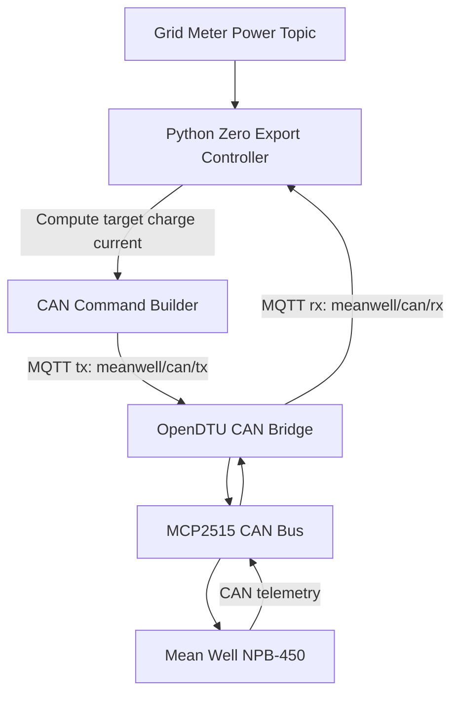
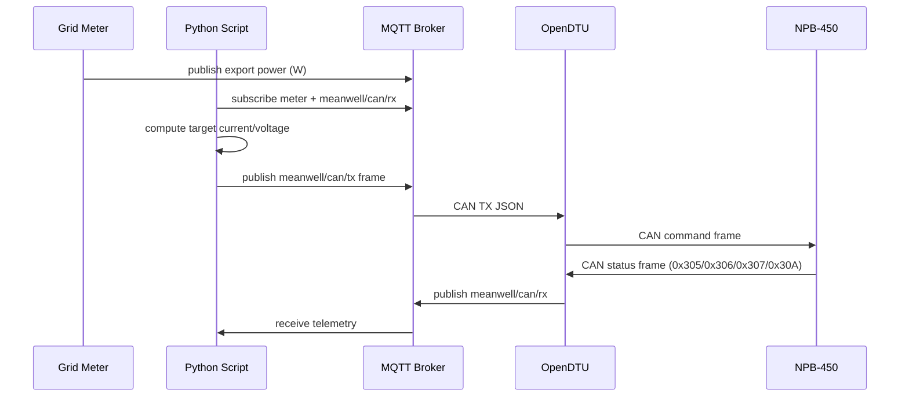

# NPB-450 Zero Export Example

This folder contains a complete example stack for your setup:

1. ESP32 + CMT2300A (Hoymiles)
2. LAN8720 Ethernet
3. MCP2515 CAN bridge
4. Mean Well NPB-450 charger
5. 12V 330Ah LiFePO4 battery

## Files

1. `device_profile_npb450_gateway.json`: Device pin mapping profile for your board.
2. `meanwell_npb450_can_profile.example.json`: CAN/MQTT protocol profile used by the Python script.
3. `npb450_zero_export_sim.py`: Example zero-export control loop over OpenDTU MQTT CAN topics.

## Pin Mapping

| Function | GPIO |
|---|---|
| CMT CLK | 12 |
| CMT SDIO | 14 |
| CMT CS | 4 |
| CMT FCS | 16 |
| CMT GPIO2 | 2 |
| CMT GPIO3 | 3 |
| ETH MDC | 23 |
| ETH MDIO | 18 |
| ETH POWER | 17 |
| CAN SCK | 32 |
| CAN MOSI | 33 |
| CAN MISO | 34 |
| CAN CS | 5 |
| CAN INT | 27 |

## MQTT CAN Topics

OpenDTU CAN bridge topics:

1. TX commands: `<prefix>meanwell/can/tx`
2. RX frames: `<prefix>meanwell/can/rx`

Frame schema:

```json
{
  "id": 773,
  "ext": false,
  "rtr": false,
  "dlc": 8,
  "data": [0, 1, 2, 3, 4, 5, 6, 7]
}
```

## CAN IDs

These receive IDs are already decoded by OpenDTU in `src/MeanwellCan.cpp`:

| ID | Meaning in integration |
|---|---|
| `0x305` | Charger output values |
| `0x306` | Battery-side values |
| `0x307` | Charger temperature and status |
| `0x30A` | Alarm/status word |

Transmit IDs (`set_charge_current`, `set_charge_voltage`, `charger_enable`) are profile-driven in `meanwell_npb450_can_profile.example.json`.
Set them according to your official Mean Well NPB-450 CAN protocol document before enabling live control.

## Zero Export Automation Flow





## Run Example Script

Install dependency:

```bash
pip install paho-mqtt
```

Run:

```bash
python3 examples/npb450_zero_export_sim.py \
  --broker 192.168.1.10 \
  --grid-topic home/grid/power_export_w \
  --profile examples/meanwell_npb450_can_profile.example.json \
  --charge-voltage-v 14.2 \
  --max-charge-current-a 30 \
  --max-charge-power-w 430
```

## Battery Parameters (12V 330Ah LiFePO4)

Recommended starting points for simulation:

1. `--charge-voltage-v 14.2`
2. `--max-charge-current-a 30` (limited by NPB-450 power envelope)
3. `--max-charge-power-w 430`
4. `--deadband-w 40`

Tune these based on your BMS limits and charger configuration.
