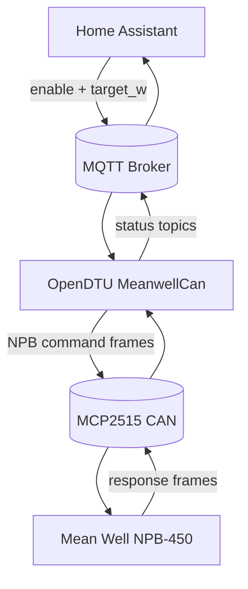

# NPB-450 Integration Examples

This folder contains practical examples for two control paths:

1. **Raw CAN mode**: Home Assistant (or host script) sends exact CAN command frames.
2. **Abstract mode**: Home Assistant sends only `ON/OFF` and `target_w`, while OpenDTU performs NPB-450 command generation, initialization, and validation internally.

## Files

1. `device_profile_npb450_gateway.json`: pin mapping profile for ESP32 + CMT + ETH + MCP2515.
2. `meanwell_npb450_can_profile.example.json`: profile used by the raw Python script.
3. `npb450_zero_export_sim.py`: raw CAN control example over MQTT.
4. `ha_emulator_dummy_loop.py`: host-side dummy Home Assistant emulator (raw + abstract modes).
5. `home_assistant_npb450_package.yaml`: Home Assistant package example for abstract mode.

## Pin Mapping

| Function | GPIO |
|---|---|
| CMT CLK | 12 |
| CMT SDIO | 14 |
| CMT CS | 4 |
| CMT FCS | 16 |
| CMT GPIO2 | 2 |
| CMT GPIO3 | 3 |
| ETH MDC | 23 |
| ETH MDIO | 18 |
| ETH POWER | 17 |
| CAN SCK | 32 |
| CAN MOSI | 33 |
| CAN MISO | 34 |
| CAN CS | 5 |
| CAN INT | 27 |

## MQTT Topics

Assuming MQTT prefix `solar/`.

### Raw frame topics

1. TX: `solar/meanwell/can/tx`
2. RX: `solar/meanwell/can/rx`

Raw frame schema:

```json
{
  "id": 786688,
  "ext": true,
  "rtr": false,
  "dlc": 4,
  "data": [194, 0, 0, 4]
}
```

### Abstract NPB-450 control topics (implemented in OpenDTU)

Control:

1. `solar/meanwell/npb450/control/enable` (`ON/OFF`, `true/false`, `1/0`)
2. `solar/meanwell/npb450/control/target_w` (float watts)
3. `solar/meanwell/npb450/control/commission_psu` (`ON` to send one-time PSU command)

Config:

1. `solar/meanwell/npb450/config/charge_voltage_v`
2. `solar/meanwell/npb450/config/max_current_a`
3. `solar/meanwell/npb450/config/address` (0..15)

Status:

1. `solar/meanwell/npb450/status/init_state`
2. `solar/meanwell/npb450/status/control_enabled`
3. `solar/meanwell/npb450/status/target_w`
4. `solar/meanwell/npb450/status/target_iout`
5. `solar/meanwell/npb450/status/target_vout`
6. `solar/meanwell/npb450/status/iout_actual`
7. `solar/meanwell/npb450/status/psu_mode_ok`
8. `solar/meanwell/npb450/status/eeprom_lock_ok`
9. `solar/meanwell/npb450/status/address`

## NPB-450 CAN specifics implemented in OpenDTU

The firmware now directly implements:

1. Extended CAN 29-bit ID control (`0x000C0100 + address`)
2. 4-byte command payload format (`cmd_lo, cmd_hi, data_lo, data_hi`)
3. Boot-time EEPROM lock command (`SYSTEM_CONFIG 0x00C2`, data `0x0400`)
4. Validation polling for:
   - `SYSTEM_STATUS 0x00C1` (PSU mode bit check)
   - `SYSTEM_CONFIG 0x00C2` (EEPROM lock bit check)
5. Runtime setpoint control:
   - `VOUT_SET 0x0020`
   - `IOUT_SET 0x0030`
   - `OPERATION 0x0000`
6. Optional commissioning command:
   - `CURVE_CONFIG 0x00B4` with data `0x0004`

## Control mode A: Raw CAN from Home Assistant

Use this when HA should own exact CAN payload generation.

Example command sequence:

1. Lock EEPROM writes:
   - ID `0x000C0100`, data `C2 00 00 04`
2. Set VOUT 14.4V (`14.4 / 0.01 = 1440 = 0x05A0`):
   - ID `0x000C0100`, data `20 00 A0 05`
3. Set IOUT 12.5A (`12.5 / 0.01 = 1250 = 0x04E2`):
   - ID `0x000C0100`, data `30 00 E2 04`
4. Enable output:
   - ID `0x000C0100`, data `00 00 01 00`

Use `npb450_zero_export_sim.py` for raw mode simulation.

## Control mode B: Abstract watt target from Home Assistant

Use this when OpenDTU should own all NPB details.

Required HA outputs:

1. `control/enable`
2. `control/target_w`

OpenDTU then:

1. Performs initialization state machine
2. Validates PSU + EEPROM lock state
3. Converts watts to current (`I = P / V`)
4. Sends NPB setpoint commands at fixed interval

Use `home_assistant_npb450_package.yaml` as template.

## Automation flow



## Host-side validation loop

Abstract mode:

```bash
python3 examples/ha_emulator_dummy_loop.py \
  --broker 192.168.1.10 \
  --mode abstract \
  --prefix solar/
```

Raw mode:

```bash
python3 examples/ha_emulator_dummy_loop.py \
  --broker 192.168.1.10 \
  --mode raw \
  --prefix solar/ \
  --charger-address 0
```

## Battery defaults for 12V 330Ah LiFePO4

Suggested initial values:

1. Charge voltage: `14.2 - 14.4V`
2. Max current: `<= 30A` for NPB-450 envelope
3. Max target power: `<= 430W`
4. Deadband: `40W`

Adjust to your BMS rules and temperature policy.
